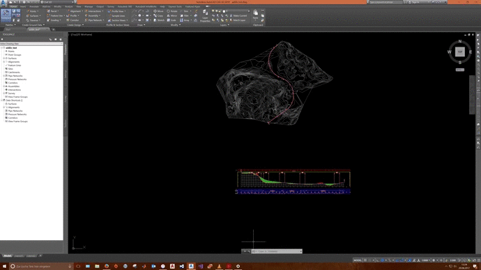
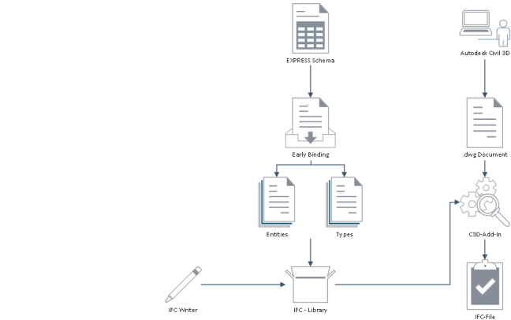

# Civil 3D IFC Alignment Plug-In #

## Vision ##
This piece of software was developed in the writing process of my Bachelor's thesis, starting in May 2017, with no prior coding experience. I am aware of the possible bad coding practice within the source code.
However, I decided to publish this program hoping that it may be useful for more experienced software developers who might improve it in order to make the IFC (Industry Foundation Classes) file format more accessible 
for a wider group of people. The corresponding Bachelor's thesis can be found under the following: [Development of an IFC Alignment Export Plug-in for Autodesk AutoCAD Civil 3D](https://www.cms.bgu.tum.de/de/lehre/abgeschlossene-arbeiten/abgeschlossenebachelorarbeiten).
## Workflow ##

## Description ##
Civil 3D IFC Alignment Plug-In is an plug-in for Autodesk AutoCAD Civil 3D (2018), that lets the user export surface data and alignments to the IFC file format standard.
It also includes a C\# IFC class library. Yet, only the export function is fully supported although a import function is already in development and included in the plug-in. 
The Early Binding itself and the Plug-In is still in developing state and  bugs are still possible.
NOTE: Large surfaces result in long export and import times. To speed up the import the imported surface will be less detailed, than the original surface. 
All exported files have been tested with [IFC Engine - IFC Viewer](http://www.ifcbrowser.com/). 
## Included Software ##

* ### Civil 3D Plug-in ###
* ### C# Early Binding ###

## Current Development State ##
### Export: ###
* Surface
* Horizontal Alignment
* Vertical Alignment
### Import: ###
* Surface (should be working fine)
* Horizontal Alignment
* Vertical Alignment (in development)

## How to use this Software ##
### IFC C# Class Library: ###
You can simply use this library by adding it to your current project as a reference.
### Civil 3D Plug-In: ###
1. Start Civil 3D 
2. Type "netload" in the command-line, press enter and navigate to the plug-in
3. Select the plug-in and press "load"
4. In the next dialog select "load once" ("always load" is also possible)
5. A license agreement dialog will appear, press accept
6. Type "ifc" in the command-line and press enter
7. The Plug-In will now show in the Add-Ins Tab

## License ##
All contained software is published under the limited, non-exclusive, non-
transferable, without right to sub-license terms of the End User License 
Agreement (EULA) that is delivered with this Software.

Unauthorized use, copying, reverse-engineering, disassembling or decompiling 
via any medium is strictly prohibited.

All contained software is distributed in the hope that it will be useful, 
but WITHOUT ANY WARRANTY; without even the implied warranty of MERCHAN-
TABILITY or FITNESS FOR A PARTICULAR PURPOSE.  See the EULA for more details.

You should have received a copy of the EULA along with this software and . 
If not, contact <f.rampf@tum.de>.

## Copyright ##
Copyright (c) 2017 Felix Rampf - <f.rampf@tum.de>
